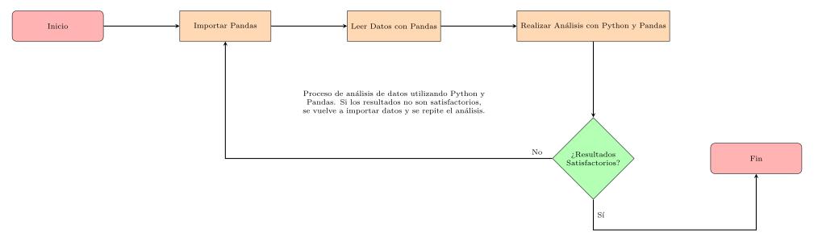
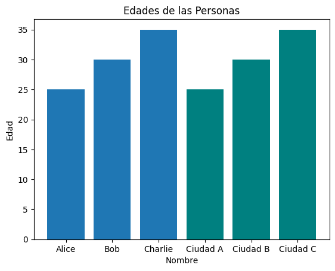
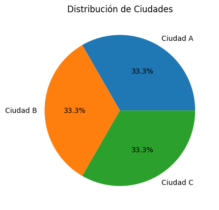
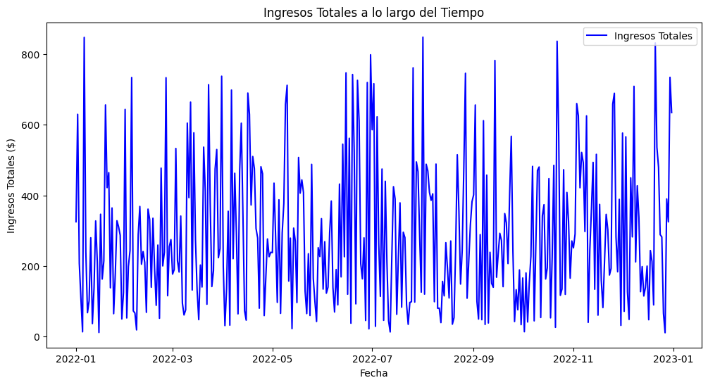
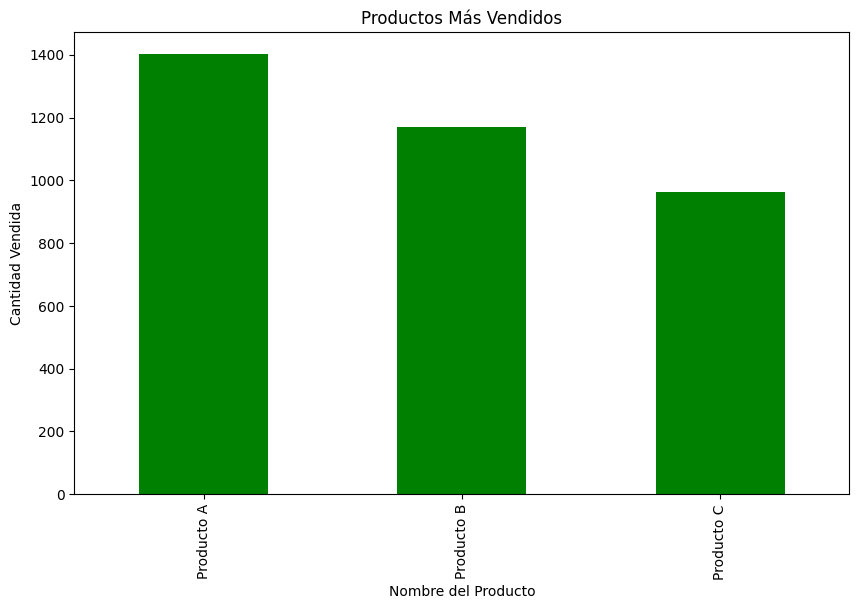

<<<<<<< HEAD
# Módulo 1: Introducción a Pandas

# Presentación y Objetivos del Curso

<p align="center" style="border: 2px solid black; padding: 10px; border-radius: 10px;">
  
</p>


# Introducción a Pandas con Python

## Objetivos del Curso
- Comprender la importancia de Pandas en el análisis de datos.
- Aprender los conceptos básicos de Pandas.


# ¿Qué es Pandas?
<p align="center" style="border: 2px solid black; padding: 10px; border-radius: 10px;">
  
</p>

## ¿Qué es Pandas?

Pandas es una biblioteca de Python diseñada para la manipulación y el análisis de datos. 
Proporciona estructuras de datos flexibles y herramientas para trabajar con conjuntos de datos estructurados.


# Instalación de Pandas en Colab

## Instalación de Pandas en Google Colab

Para instalar pandas en Colab, ejecute el siguiente comando:

```python
!pip install pandas
```

# Estructuras de Datos en Pandas

Pandas ofrece dos estructuras principales: Series y DataFrames.

- Series: Una serie es una estructura de una dimensión que puede contener cualquier tipo de datos.
- DataFrames: Un DataFrame es una estructura bidimensional, similar a una tabla, que organiza los datos en filas y columnas.

## Series en Pandas

Una **Serie** en Pandas es una estructura de datos unidimensional que puede contener cualquier tipo de datos. Se puede ver como una columna en una hoja de cálculo o como un array unidimensional. Para crear una Serie, simplemente utilizamos el constructor `pd.Series()` de Pandas:

```python
import pandas as pd

# Crear una Serie
mi_serie = pd.Series([1, 2, 3, 4, 5])
print(mi_serie)
```
0    1
1    2
2    3
3    4
4    5
dtype: int64


## DataFrames en Pandas

Un **DataFrame** en Pandas es una estructura de datos bidimensional similar a una tabla de base de datos **SQL** o una hoja de cálculo de **Excel**. Es como un conjunto de Series que comparten el mismo índice. Para crear un DataFrame, use el constructor `pd.DataFrame()`:

```python
# Crear un DataFrame
datos = {'Nombre': ['Alice', 'Bob', 'Charlie'],
         'Edad': [25, 30, 35],
         'Ciudad': ['Ciudad A', 'Ciudad B', 'Ciudad C']}

mi_dataframe = pd.DataFrame(datos)


mi_dataframe.head()
```
|   | Nombre  | Edad | Ciudad  |
|---|---------|------|---------|
| 0 | Alice   | 25   | Ciudad A|
| 1 | Bob     | 30   | Ciudad B|
| 2 | Charlie | 35   | Ciudad C|

```python
mi_dataframe.describe() #Devuelve datos estadísticos del DataFrame
```

|      | Edad |
|------|:--------:|
| count| 3.0  |
| mean | 30.0 |
| std  | 5.0  |
| min  | 25.0 |
| 25%  | 27.5 |
| 50%  | 30.0 |
| 75%  | 32.5 |
| max  | 35.0 |

```python
import matplotlib.pyplot as plt

plt.bar(mi_dataframe['Nombre'], mi_dataframe['Edad'])
plt.bar(mi_dataframe['Ciudad'], mi_dataframe['Edad'], color='teal')
plt.xlabel('Nombre')
plt.ylabel('Edad')
plt.title('Edades de las Personas')
plt.show()
```

<p align="center" style="border: 2px solid black; padding: 10px; border-radius: 10px;">
  
</p>

```python
plt.pie(mi_dataframe['Ciudad'].value_counts(), labels=mi_dataframe['Ciudad'].unique(), autopct='%1.1f%%')
plt.title('Distribución de Ciudades')
plt.show()
```

<p align="center" style="border: 2px solid black; padding: 10px; border-radius: 10px;">
  
</p>

# Experimento
##  Análisis y Visualización de Datos de Ventas


El objetivo de este experimento es introducir a los participantes en la manipulación y visualización de datos utilizando la biblioteca pandas en Python. Se utilizará un conjunto de datos ficticio de ventas generadas aleatoriamente para realizar operaciones básicas de manipulación y generar visualizaciones informativas.

### Paso 1: Importar Bibliotecas

```python
import pandas as pd
import numpy as np
import matplotlib.pyplot as plt
```

### Paso 2: Generar Datos Aleatorios de Ventas

```python
# Crear un DataFrame con datos aleatorios de ventas
np.random.seed(42)  # Para reproducibilidad
fecha_inicio = pd.to_datetime('2022-01-01')
fecha_fin = pd.to_datetime('2022-12-31')
fechas = pd.date_range(fecha_inicio, fecha_fin, freq='D')

datos = {
    'ID Producto': np.random.choice(range(1, 6), size=len(fechas)),
    'Nombre del Producto': np.random.choice(['Producto A', 'Producto B', 'Producto C'], size=len(fechas)),
    'Cantidad': np.random.randint(1, 20, size=len(fechas)),
    'Precio Unitario': np.random.uniform(10, 50, size=len(fechas))
}

df = pd.DataFrame(datos, index=fechas)

df
```
|     | ID Producto | Nombre del Producto | Cantidad | Precio Unitario |
|-------------|-------------|---------------------|----------|------------------|
| 2022-01-01  | 4           | Producto B          | 19       | 17.121439       |
| 2022-01-02  | 5           | Producto A          | 13       | 48.442813       |
| 2022-01-03  | 3           | Producto B          | 13       | 15.946509       |
| 2022-01-04  | 5           | Producto C          | 4        | 26.584965       |
| 2022-01-05  | 5           | Producto C          | 1        | 13.413987       |
| ...         | ...         | ...                 | ...      | ...              |
| 2022-12-27  | 4           | Producto A          | 1        | 10.884942       |
| 2022-12-28  | 4           | Producto B          | 17       | 22.944409       |
| 2022-12-29  | 4           | Producto A          | 11       | 29.545728       |
| 2022-12-30  | 5           | Producto B          | 18       | 40.816297       |
| 2022-12-31  | 4           | Producto A          | 17       | 37.331815       |

365 rows × 4 columns


### Paso 3: Explorar el Conjunto de Datos
```python
# Mostrar las primeras filas del conjunto de datos
print(df.head())
```
|     | ID Producto | Nombre del Producto | Cantidad | Precio Unitario |
|-------------|-------------|---------------------|----------|------------------|
| 2022-01-01  | 4           | Producto B          | 19       | 17.121439       |
| 2022-01-02  | 5           | Producto A          | 13       | 48.442813       |
| 2022-01-03  | 3           | Producto B          | 13       | 15.946509       |
| 2022-01-04  | 5           | Producto C          | 4        | 26.584965       |
| 2022-01-05  | 5           | Producto C          | 1        | 13.413987       |

```python
# Obtener información general del conjunto de datos
print(df.info())

```
<class 'pandas.core.frame.DataFrame'>
DatetimeIndex: 365 entries, 2022-01-01 to 2022-12-31
Freq: D
Data columns (total 4 columns):
 \#   Column               Non-Null Count  Dtype  
\---  ------               --------------  -----  
 0   ID Producto          365 non-null    int64  
 1   Nombre del Producto  365 non-null    object 
 2   Cantidad             365 non-null    int64  
 3   Precio Unitario      365 non-null    float64
dtypes: float64(1), int64(2), object(1)
memory usage: 14.3+ KB
None


```python
# Estadísticas descriptivas
print(df.describe())
```
|            | ID Producto | Cantidad | Precio Unitario |
|------------|-------------|----------|------------------|
| **count**  | 365.0       | 365.0    | 365.0            |
| **mean**   | 2.94        | 9.68     | 30.08            |
| **std**    | 1.40        | 5.55     | 11.96            |
| **min**    | 1.0         | 1.0      | 10.26            |
| **25%**    | 2.0         | 5.0      | 19.24            |
| **50%**    | 3.0         | 9.0      | 30.98            |
| **75%**    | 4.0         | 15.0     | 40.69            |
| **max**    | 5.0         | 19.0     | 49.92            |

### Paso 4: Manipulación de Datos
```python
# Agregar una columna de ingresos totales
df['Ingresos Totales'] = df['Cantidad'] * df['Precio Unitario']
```

|    | ID Producto | Nombre del Producto | Cantidad | Precio Unitario | Ingresos Totales |
|-------------|-------------|---------------------|----------|------------------|-------------------|
| 2022-01-01  | 4           | Producto B          | 19       | 17.121439       | 325.307335        |
| 2022-01-02  | 5           | Producto A          | 13       | 48.442813       | 629.756565        |
| 2022-01-03  | 3           | Producto B          | 13       | 15.946509       | 207.304618        |
| 2022-01-04  | 5           | Producto C          | 4        | 26.584965       | 106.339860        |
| 2022-01-05  | 5           | Producto C          | 1        | 13.413987       | 13.413987         |
| ...         | ...         | ...                 | ...      | ...              | ...               |
| 2022-12-27  | 4           | Producto A          | 1        | 10.884942       | 10.884942         |
| 2022-12-28  | 4           | Producto B          | 17       | 22.944409       | 390.054949        |
| 2022-12-29  | 4           | Producto A          | 11       | 29.545728       | 325.003004        |
| 2022-12-30  | 5           | Producto B          | 18       | 40.816297       | 734.693341        |
| 2022-12-31  | 4           | Producto A          | 17       | 37.331815       | 634.640856        |

365 rows × 5 columns
### Paso 5: Visualización de Datos

```python
# Visualizar las ventas totales a lo largo del tiempo
plt.figure(figsize=(12, 6))
plt.plot(df.index, df['Ingresos Totales'], label='Ingresos Totales', color='blue')
plt.title('Ingresos Totales a lo largo del Tiempo')
plt.xlabel('Fecha')
plt.ylabel('Ingresos Totales ($)')
plt.legend()
plt.show()
```

<p align="center" style="border: 2px solid black; padding: 10px; border-radius: 10px;">
  
</p>

### Paso 6: Análisis Adicional

```python
# Calcular el producto más vendido
producto_mas_vendido = df.groupby('Nombre del Producto')['Cantidad'].sum().idxmax()
print(f'El producto más vendido es: {producto_mas_vendido}')

# Visualizar los productos más vendidos
productos_mas_vendidos = df.groupby('Nombre del Producto')['Cantidad'].sum().sort_values(ascending=False)
plt.figure(figsize=(10, 6))
productos_mas_vendidos.plot(kind='bar', color='green')
plt.title('Productos Más Vendidos')
plt.xlabel('Nombre del Producto')
plt.ylabel('Cantidad Vendida')
plt.show()
```

```bash
El producto más vendido es: Producto A
```
<p align="center" style="border: 2px solid black; padding: 10px; border-radius: 10px;">
  
</p>


# Comentarios y Análisis
Diversidad de Productos: El conjunto de datos refleja la venta de varios productos (Producto A, Producto B y Producto C) a lo largo del año. Esta diversidad podría indicar una oferta variada para los clientes.

Cantidad de Ventas: Se observa que las cantidades de venta varían, con productos vendiendo desde 1 hasta 19 unidades en un solo día. Esto sugiere una dinámica de demanda cambiante o posiblemente estrategias de lanzamiento de nuevos productos.

Precio Unitario: El precio unitario de los productos también varía considerablemente, desde alrededor de 10 hasta casi 50. Este rango de precios puede influir en los ingresos totales y la rentabilidad.

Ingresos Totales: Los ingresos totales reflejan la multiplicación de la cantidad vendida por el precio unitario. Hay días con ingresos significativos, posiblemente asociados a días de alta demanda o ventas de productos más costosos.

Producto Más Vendido: Se puede determinar el producto más vendido al analizar la cantidad total vendida de cada producto. Este tipo de análisis puede ayudar en la toma de decisiones sobre la gestión de inventario y estrategias de marketing.

Análisis Temporal: La variación de las ventas a lo largo del tiempo podría revelar patrones estacionales o tendencias a considerar al planificar estrategias de marketing y gestión de inventario.

Rentabilidad del Producto: Analizar la relación entre el precio unitario y la cantidad vendida puede proporcionar información sobre la rentabilidad de cada producto. Algunos productos pueden generar mayores ingresos a pesar de tener una cantidad de ventas menor debido a su precio unitario más alto.

Optimización de Inventario: La información sobre la cantidad vendida y la frecuencia puede ser valiosa para la optimización del inventario, asegurando que haya suficiente stock para satisfacer la demanda sin incurrir en excesos no deseados.

Tendencias de Ventas: Al observar las tendencias de ventas, se pueden identificar períodos de aumento o disminución de la demanda. Esto puede ser útil para ajustar estrategias de marketing o lanzar promociones en momentos estratégicos.

 Necesidad de Análisis Adicional: Aunque este conjunto de datos proporciona información valiosa, análisis más detallados, como la segmentación de clientes, pueden proporcionar una comprensión más profunda del comportamiento del consumidor y facilitar decisiones más precisas.


=======
# Int_Pandas
Este es una guía básica de la manipulación de datos con Pandas.
>>>>>>> origin/main
